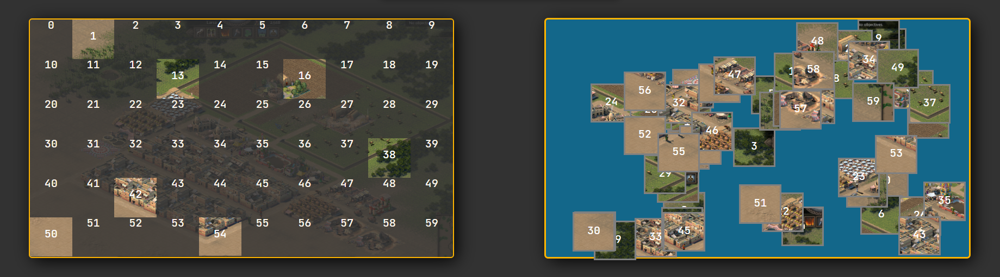

## To practice Drag and Drop with Javascript, I realize this puzzle game (WIP)

### Quick description
- using react library to make this project
- user using a form to upload an image and indicate aspect ratio
- this image is split into 60 pieces
- a drop area is generated with the uploaded image in background hight opacity
- another area is genarated with a random displaying of 60 pieces from the uploaded image
- each puzzle piece can be dragged and dropped only on its corresponding position in the pattern area

(The project is in work in progress, puzzle pieces and drop area still have numbers to help developpement and design aren't finished)

### Area of improvment
- the aspect ratio is in work in progress (only 16/9 aspect ratio is supported)
- I would like to namge 1/1 3/2 4/3 ratios and add possibility to make portrait orientation
- improving design

<h1 align="center">Screenshots</h1>

 
    
    

 

